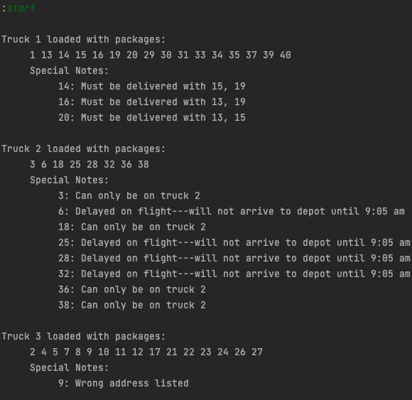
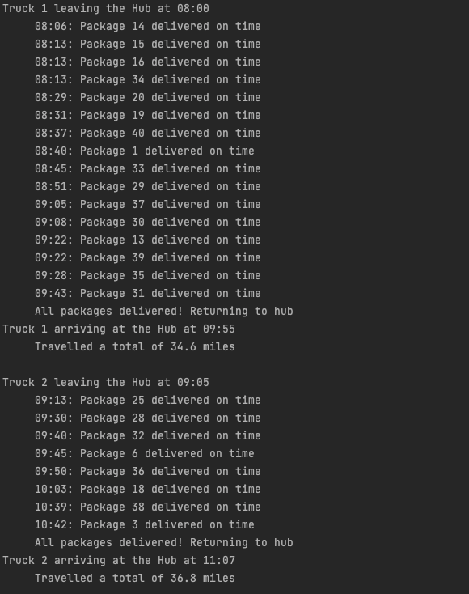
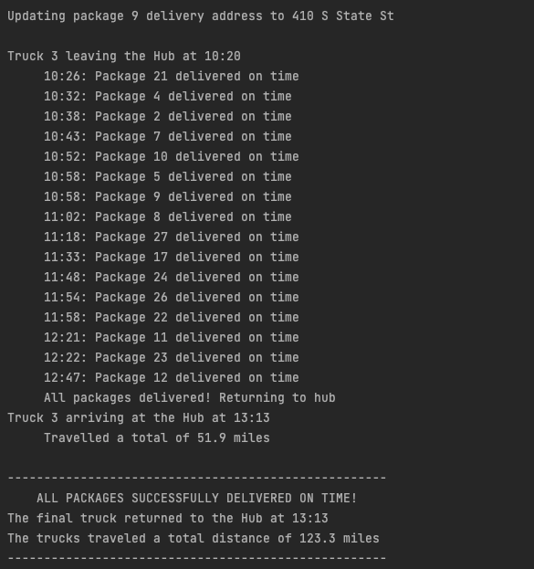
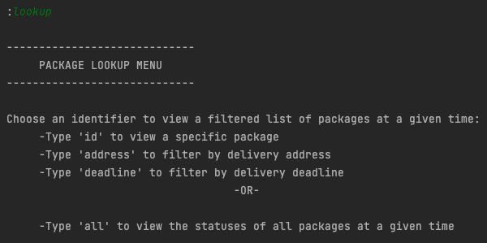
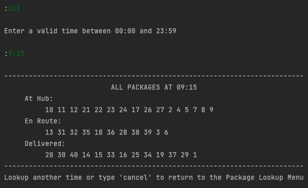
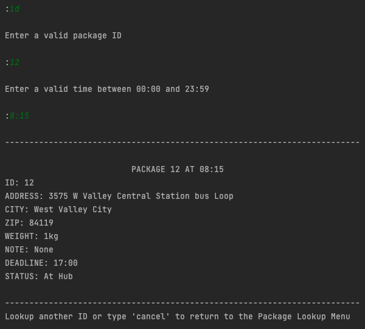

<div align="center">

  
  <h1>WGUPS Routing Program</h1>
  
  <p>
    A package routing program made with Python
  </p>
  
  
<!-- Badges -->

[![Contributors][contributors-shield]][contributors-url]
![Last Commit][lastcommit-shield]
[![MIT License][license-shield]][license-url]
[![LinkedIn][linkedin-shield]][linkedin-url]

<h4>
    <a href="https://github.com/nbalabis/package-routing/issues/">Report Bug</a>
  </h4>
</div>

<br />

<!-- Table of Contents -->

# :notebook_with_decorative_cover: Table of Contents

- [About the Project](#star2-about-the-project)
  - [Screenshots](#camera-screenshots)
  - [Tech Stack](#space_invader-tech-stack)
  - [Features](#dart-features)
- [Getting Started](#toolbox-getting-started)
  - [Prerequisites](#bangbang-prerequisites)
  - [Run Locally](#running-run-locally)
- [License](#warning-license)
- [Contact](#handshake-contact)

<!-- About the Project -->

## :star2: About the Project

This project was made to complete WGU's Data Structures and Algorithms II course.

# Scenario

The Western Governors University Parcel Service (WGUPS) needs to determine an efficient route and delivery distribution for their Daily Local Deliveries (DLD) because packages are not currently being consistently delivered by their promised deadline. The Salt Lake City DLD route has three trucks, two drivers, and an average of 40 packages to deliver each day. Each package has specific criteria and delivery requirements.

Your task is to determine an algorithm, write code, and present a solution where all 40 packages (listed in the attached “WGUPS Package File”) will be delivered on time while meeting each package’s requirements and keeping the combined total distance traveled under 140 miles for both trucks. The specific delivery locations are shown on the attached “Salt Lake City Downtown Map,” and distances to each location are given in the attached “WGUPS Distance Table.” The intent is to use the program for this specific location and also for many other cities in each state where WGU has a presence. As such, you will need to include detailed comments to make your code easy to follow and to justify the decisions you made while writing your scripts.

Keep in mind that the supervisor should be able to see, at assigned points, the progress of each truck and its packages by any of the variables listed in the “WGUPS Package File,” including what has been delivered and at what time the delivery occurred.

# Assumptions

•   Each truck can carry a maximum of 16 packages, and the ID number of each package is unique.

•   The trucks travel at an average speed of 18 miles per hour and have an infinite amount of gas with no need to stop.

•   There are no collisions.

•   Three trucks and two drivers are available for deliveries. Each driver stays with the same truck as long as that truck is in service.

•   Drivers leave the hub no earlier than 8:00 a.m., with the truck loaded, and can return to the hub for packages if needed. 

•   The delivery and loading times are instantaneous, i.e., no time passes while at a delivery or when moving packages to a truck at the hub (that time is factored into the calculation of the average speed of the trucks).

•   There is up to one special note associated with a package.

•   The delivery address for package #9, Third District Juvenile Court, is wrong and will be corrected at 10:20 a.m. WGUPS is aware that the address is incorrect and will be updated at 10:20 a.m. However, WGUPS does not know the correct address (410 S State St., Salt Lake City, UT 84111) until 10:20 a.m.

•   The distances provided in the WGUPS Distance Table are equal regardless of the direction traveled.

•   The day ends when all 40 packages have been delivered.

<!-- Screenshots -->

### :camera: Screenshots

<div align="center"> 
  
  
  
  
  
  
</div>

<!-- TechStack -->

### :space_invader: Tech Stack

[![Python][python.js]][python-url]

<!-- Features -->

### :dart: Features

- Determine efficient delivery route for each truck
- Deliver all packages on time and within constraints
- Look up the status of all packages at a given time
- Look up packages by id, delivery deadline, or delivery address

<!-- Getting Started -->

## :toolbox: Getting Started

<!-- Prerequisites -->

### :bangbang: Prerequisites

This project requires the latest version Python

<!-- Run Locally -->

### :running: Run Locally

Clone the project

```bash
  git clone https://github.com/nbalabis/package-routing.git
```

Go to the project directory

```bash
  cd package-routing
```

Run the main file

```bash
  python3 main.py
```

Runs the program in the terminal.

<!-- License -->

## :warning: License

Distributed under the MIT License. See LICENSE.txt for more information.

<!-- Contact -->

## :handshake: Contact

Nicholas Balabis - [LinkedIn](https://www.linkedin.com/in/nicholas-balabis-094571153/) - balabisnicholas@gmail.com

Project Link: [https://github.com/nbalabis/package-routing](https://github.com/nbalabis/package-routing)


<div align="center"> 
  
</div>

<!-- MARKDOWN LINKS & IMAGES -->

[linkedin-shield]: https://img.shields.io/badge/-LinkedIn-black.svg?style=for-the-badge&logo=linkedin&colorB=555
[linkedin-url]: https://www.linkedin.com/in/nicholas-balabis-094571153/
[contributors-shield]: https://img.shields.io/github/contributors/nbalabis/package-routing.svg?style=for-the-badge
[contributors-url]: https://github.com/nbalabis/package-routing/graphs/contributors
[lastcommit-shield]: https://img.shields.io/github/last-commit/nbalabis/package-routing.svg?style=for-the-badge
[license-shield]: https://img.shields.io/github/license/nbalabis/package-routing.svg?style=for-the-badge
[license-url]: https://github.com/nbalabis/package-routing/blob/main/LICENSE
[python.js]: https://img.shields.io/badge/Python-3776ab?style=for-the-badge&logo=python&logoColor=FFD343
[python-url]: https://www.python.org
